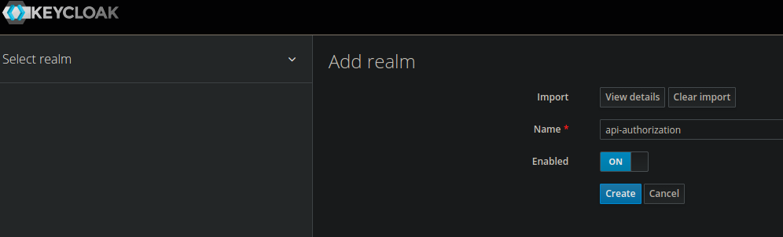

# Spring API Security

+ OAuth 2.0 uisng Keycloak

## Start Keycloak

```shell
docker run --name keycloak -p 8080:8080 -e KEYCLOAK_ADMIN=admin -e KEYCLOAK_ADMIN_PASSWORD=admin quay.io/keycloak/keycloak:18.0.0 start-dev
```

Create a new realm importing [realm-api-authorization.json](realm-api-authorization.json)


## spring-rest-token-validation

Validade a token by hand, without framework

+ Userinfo endpoint
+ Token Introspection endpoint

```shell
./script.sh
```

## spring-boot-starter-oauth2-resource-server

Using Spring OAuth2 Resource Server a Client Credentials Flow

- Opaque Token -> Instospection (OpaqueTokenAuthenticationProvider.class)
- JWL -> (JwtAuthenticationProvider.class)
- Resolve Autentication strategy for diferents endpoits

## keycloak-spring-boot-starter

https://www.keycloak.org/docs/latest/securing_apps/#_spring_boot_adapter

