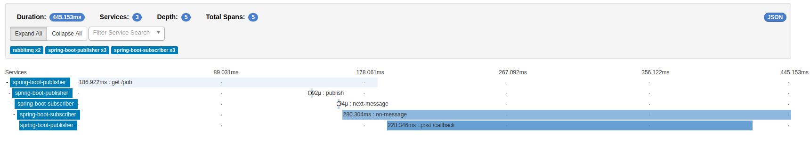

# Spring Boot Zipkin  Ecosystem

## Build
```bash
./gradlew clean build -p spring-boot-2-subscriber-rest

./gradlew clean build -p spring-boot-2-publisher-rest 
```

## Docker Up

```bash
docker-compose up --build
```

## Try

```bash
curl localhost:8080/pub    
```
```text
publisher     | 2018-05-31 21:56:29.888  INFO [spring-boot-publisher,b8fdf34b88f78ee2,b8fdf34b88f78ee2,true] 1 --- [p-nio-80-exec-1] c.a.s.resources.TriggerResource          : pub()
publisher     | 2018-05-31 21:56:29.897  INFO [spring-boot-publisher,b8fdf34b88f78ee2,b8fdf34b88f78ee2,true] 1 --- [p-nio-80-exec-1] o.s.a.r.c.CachingConnectionFactory       : Attempting to connect to: [rabbit:5672]
rabbit_1      | 2018-05-31 21:56:29.914 [info] <0.562.0> accepting AMQP connection <0.562.0> (172.17.0.5:35026 -> 172.17.0.2:5672)
rabbit_1      | 2018-05-31 21:56:29.956 [info] <0.562.0> Connection <0.562.0> (172.17.0.5:35026 -> 172.17.0.2:5672) has a client-provided name: rabbitConnectionFactory#4eeea57d:0
rabbit_1      | 2018-05-31 21:56:29.961 [info] <0.562.0> connection <0.562.0> (172.17.0.5:35026 -> 172.17.0.2:5672 - rabbitConnectionFactory#4eeea57d:0): user 'guest' authenticated and granted access to vhost '/'
publisher     | 2018-05-31 21:56:29.962  INFO [spring-boot-publisher,b8fdf34b88f78ee2,b8fdf34b88f78ee2,true] 1 --- [p-nio-80-exec-1] o.s.a.r.c.CachingConnectionFactory       : Created new connection: rabbitConnectionFactory#4eeea57d:0/SimpleConnection@1339d907 [delegate=amqp://guest@172.17.0.2:5672/, localPort= 35026]
publisher     | 2018-05-31 21:56:29.970  INFO [spring-boot-publisher,b8fdf34b88f78ee2,b8fdf34b88f78ee2,true] 1 --- [p-nio-80-exec-1] o.s.amqp.rabbit.core.RabbitAdmin         : Auto-declaring a non-durable, auto-delete, or exclusive Queue (zipkin-queue) durable:false, auto-delete:false, exclusive:false. It will be redeclared if the broker stops and is restarted while the connection factory is alive, but all messages will be lost.
subscriber    | 2018-05-31 21:56:30.032  INFO [spring-boot-subscriber,b8fdf34b88f78ee2,5212fc46d712bc83,true] 1 --- [cTaskExecutor-1] c.a.springboot2subscriberrest.Listener   : Received message: 2018-05-31T21:56:29.889332
subscriber    | 2018-05-31 21:56:30.254  INFO [spring-boot-subscriber,,,] 1 --- [Sender@ea698f2}] s.c.a.AnnotationConfigApplicationContext : Refreshing SpringClientFactory-zipkin: startup date [Thu May 31 21:56:30 UTC 2018]; parent: org.springframework.boot.web.servlet.context.AnnotationConfigServletWebServerApplicationContext@73eb439a
publisher     | 2018-05-31 21:56:30.260  INFO [spring-boot-publisher,b8fdf34b88f78ee2,c9edbc079cc3616b,true] 1 --- [p-nio-80-exec-2] c.a.s.resources.CallbackResource         : callback(2018-05-31T21:56:29.889332)
subscriber    | 2018-05-31 21:56:30.302  INFO [spring-boot-subscriber,b8fdf34b88f78ee2,5212fc46d712bc83,true] 1 --- [cTaskExecutor-1] c.a.springboot2subscriberrest.Listener   : Callback from REST Response : 2018-05-31T21:56:29.889332
```

## Zipkin

```text
http://localhost:9412/zipkin/
```

